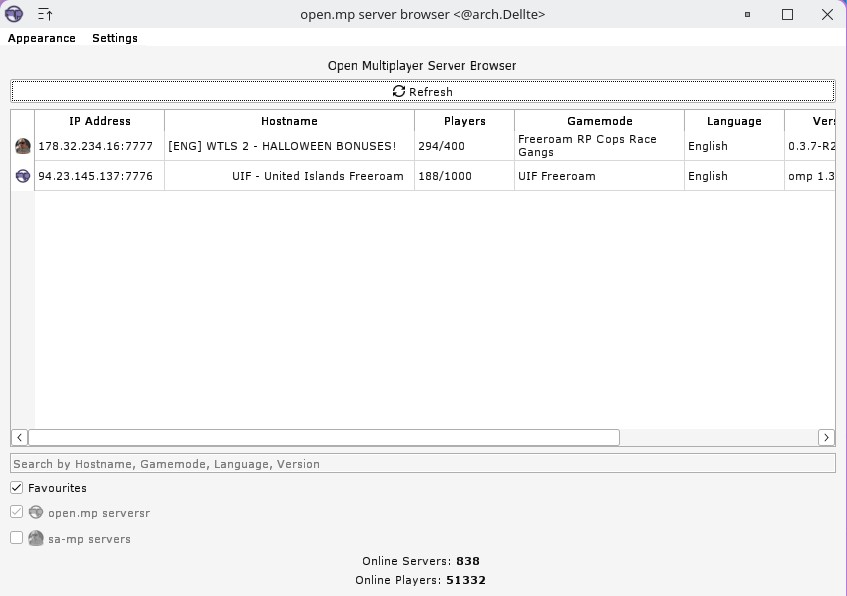
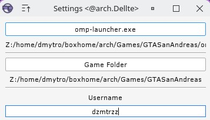
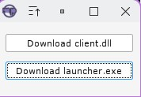

# Alternative open.mp Launcher
A fork of omp-server-browser which allows you to add favourites, connect to servers while using the omp-launcher, aimed to work on wine.

## But why?

Currently (as far as i am aware), there isn't a launcher that supports open.mp and works on wine, and therefore there isn't a way to comfortably use a gui for samp with open-mp on linux.

[Video Example](https://www.youtube.com/watch?v=gCzvV8IPk10)

## How to use?

If you follow [these steps](https://github.com/dzmtrzz/web/blob/patch-2/docs/client/ClientOnLinux.md), and you get your game to work with openmp's client modification, you're all set to use this launcher, assuming that your settings are set correctly. \
The launcher will prompt you to select the file for omp-launcher.exe, the game's folder and your username if either of those are empty. \
To connect to a server - double click the ip of that server. \
To add a server to the favourites list - double click the name of that server. \
To remove a server from the favourites list - double click the name of that server.

## Can i use this on windows?

Yes! I don't see a reason to do so, but you can!

Servers are provided from [open.mp/servers](https://www.open.mp/servers)

<kbd></kbd>

<kbd></kbd>

<kbd></kbd>

### Download
- [Releases](https://github.com/dzmtrzz/alt-omp-launcher/releases)

## Version 1.2.5
- Added a GUI downloader for open-mp client and launcher
- Fixed a bug where clicking on the open-mp servers checkmark crashes the launcher

## Version 1.2.0
- Improved user-friendliness, you can now configure the launcher through the gui.
- A bug with the favourites tab was fixed

## Version 1.1.5
- Added a favourites tab
- You can now use a config file launcher-settings.json in your GTA San Andreas User Files folder to specify the path for the game, omp launcher and your username

## Version 1.1.0
- Dark Mode theme


## Development
Build on your machine:
  - Install Python 3.8.2 (old version for program compatibility with Windows 7)
  - Open Command Prompt and cd into the repo directory
  ```bash
    cd alt-omp-launcher
  ```
  - Install dependencies
  ```bash
    python -m pip install -r requirements.txt PyInstaller
  ```
  - Build
  ```bash
    PyInstaller main.spec
  ```

The executable file goes to the `./dist` folder.
